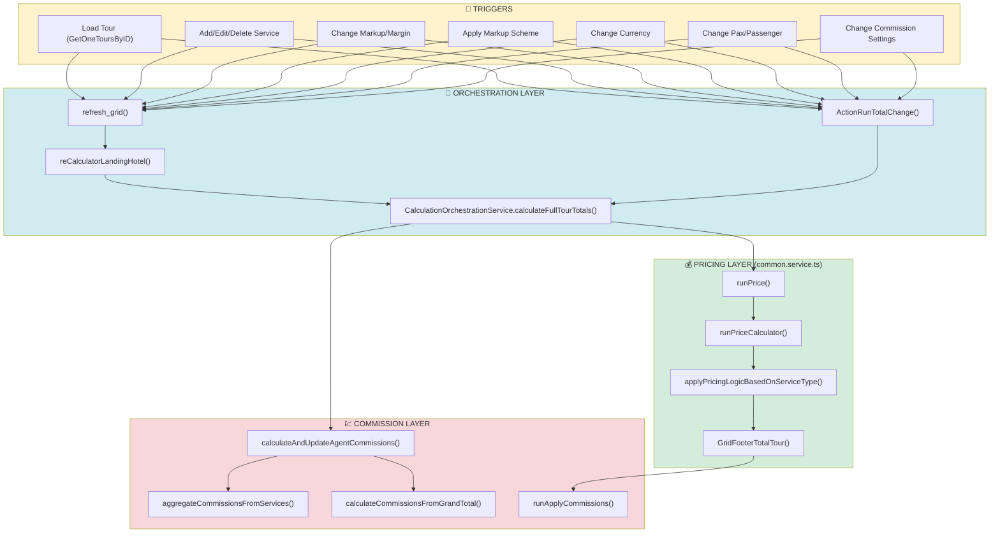
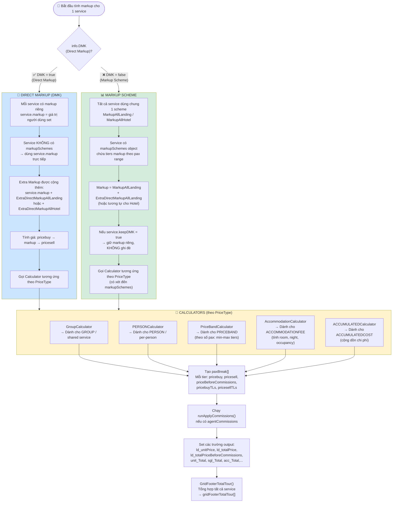
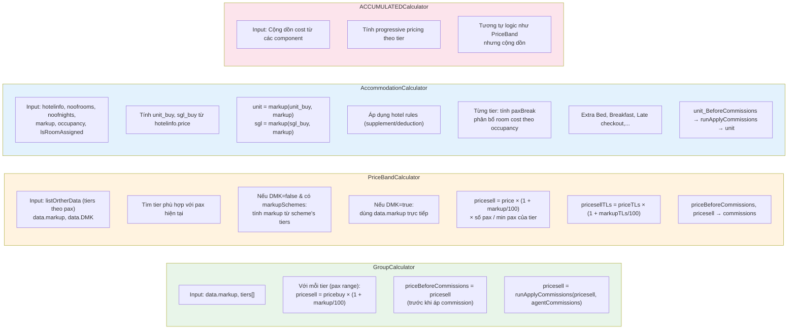
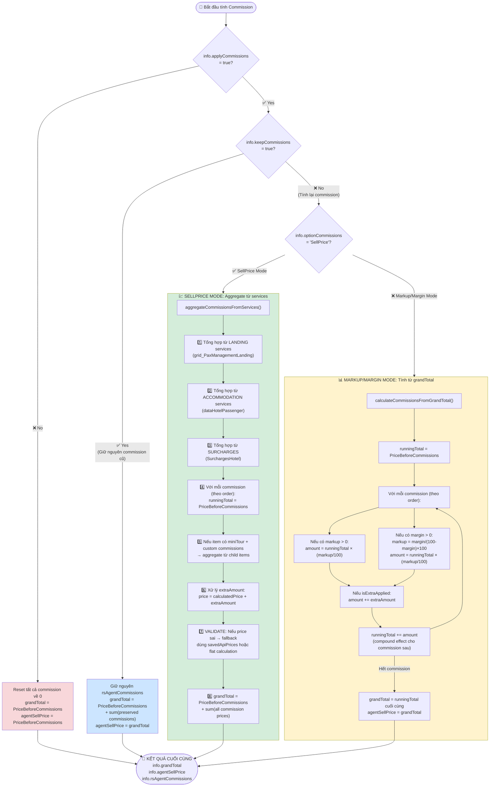
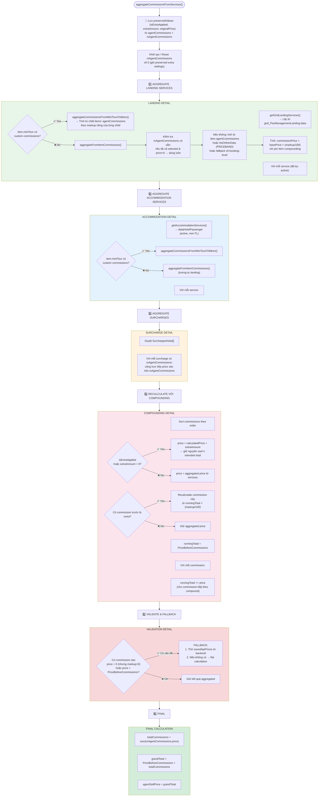
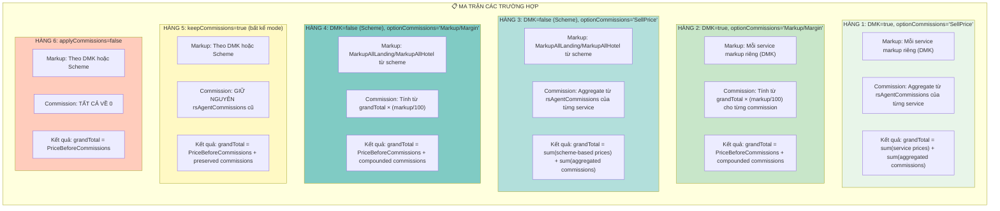
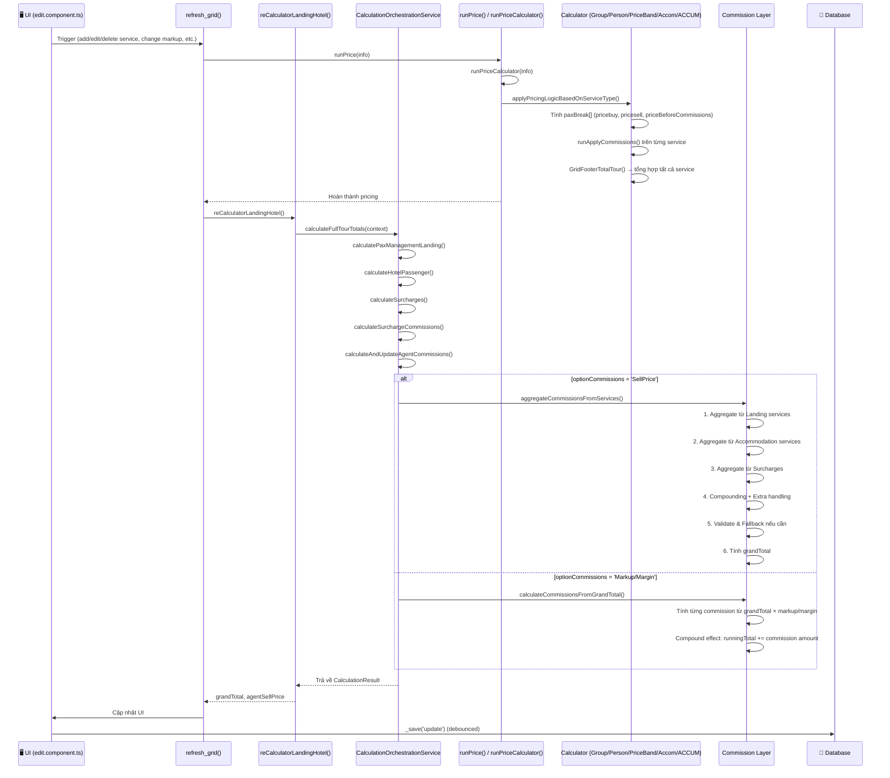

# Markup (DMK & Scheme) & Commission Calculation Logic

> **Last Updated:** 2026-06-04  
> **Source Files:**
> - `src/app/shared/services/calculation-orchestration.service.ts`
> - `src/app/shared/lib/common.service.ts`
> - `src/app/modules/admin/tours/edit/edit.component.ts`

---

## 1. TỔNG QUAN KIẾN TRÚC TÍNH TOÁN



---

## 2. LUỒNG TÍNH TOÁN MARKUP: DMK vs SCHEME



---

## 3. CHI TIẾT TỪNG CALCULATOR THEO PRICE TYPE



---

## 4. LUỒNG TÍNH TOÁN COMMISSION



---

## 5. CHI TIẾT SELLPRICE MODE: AGGREGATE COMMISSIONS TỪ SERVICES



---

## 6. MA TRẬN QUYẾT ĐỊNH: MARKUP × COMMISSION



---

## 7. THỨ TỰ THỰC THI TOÀN BỘ (Sequence Diagram)



---

## 8. CÔNG THỨC TÍNH TOÁN CHÍNH

### 8.1. Công thức Markup → Sell Price

| Loại Service | Công thức |
|---|---|
| **Group / Person** | `pricesell = pricebuy × (1 + markup/100)` |
| **PriceBand** | `pricesell = (price × (1 + markup/100) × paxCount) / minPax` |
| **Accommodation** | `unit = markup(unit_buy, markup)` → `unit_BeforeCommissions` → `runApplyCommissions()` → `unit` |
| **ACCUMULATED** | Tương tự PriceBand nhưng cộng dồn |

### 8.2. Công thức Commission (SellPrice Mode)

```
commissionPrice = basePrice × (markup/100)
```

Với **compounding**:
```
commissionPrice[i] = (PriceBeforeCommissions + Σ commissionPrice[0..i-1]) × (markup[i]/100)
```

### 8.3. Công thức Commission (Markup/Margin Mode)

```
runningTotal = PriceBeforeCommissions
commissionAmount[i] = runningTotal × (markup[i]/100)
runningTotal += commissionAmount[i]  // compound cho commission sau
grandTotal = runningTotal cuối cùng
```

### 8.4. Chuyển đổi Margin ↔ Markup

```
margin = (markup × 100) / (100 + markup)
markup = (margin × 100) / (100 - margin)
```

### 8.5. Công thức Extra Amount

```
price = calculatedPrice + extraAmount
grandTotal = PriceBeforeCommissions + Σ(price)
```

---

## 9. CÁC BIẾN QUAN TRỌNG

| Biến | Vị trí | Ý nghĩa |
|---|---|---|
| `info.DMK` | `edit.component.ts` | `true` = Direct Markup (mỗi service markup riêng), `false` = dùng Markup Scheme |
| `info.MarkupAllLanding` | `edit.component.ts` | Markup % cho tất cả landing services (Scheme mode) |
| `info.MarkupAllHotel` | `edit.component.ts` | Markup % cho tất cả accommodation services (Scheme mode) |
| `info.ExtraDirectMarkupAllLanding` | `edit.component.ts` | Extra markup cộng thêm vào landing |
| `info.ExtraDirectMarkupAllHotel` | `edit.component.ts` | Extra markup cộng thêm vào hotel |
| `info.applyCommissions` | `edit.component.ts` | `true` = có áp dụng commission |
| `info.keepCommissions` | `edit.component.ts` | `true` = giữ nguyên commission cũ, không tính lại |
| `info.optionCommissions` | `edit.component.ts` | `'SellPrice'` = aggregate từ services, khác = tính từ grandTotal |
| `info.agentCommissions[]` | `edit.component.ts` | Template commission (markup, margin, selected) |
| `info.rsAgentCommissions[]` | `edit.component.ts` | Kết quả commission đã tính (price, amount, extraAmount) |
| `info.PriceBeforeCommissions` | `edit.component.ts` | Tổng giá trước khi áp commission |
| `info.grandTotal` | `edit.component.ts` | Tổng giá cuối cùng sau commission |
| `info.agentSellPrice` | `edit.component.ts` | Giá bán cho agent (= grandTotal) |
| `service.markup` | `common.service.ts` | Markup % của từng service (DMK mode) |
| `service.markupSchemes` | `common.service.ts` | Markup scheme object (Scheme mode) |
| `service.keepDMK` | `common.service.ts` | `true` = giữ markup riêng, không bị scheme ghi đè |
| `service.ld_totalPrice` | `common.service.ts` | Tổng giá sau markup + commission |
| `service.ld_totalPriceBeforeCommissions` | `common.service.ts` | Tổng giá sau markup, trước commission |
| `service.rsAgentCommissions[]` | `common.service.ts` | Commission đã tính cho service này |

---

## 10. CÁC ĐIỂM CẦN LƯU Ý (Edge Cases)

1. **keepDMK = true**: Trong Scheme mode, nếu 1 service có `keepDMK = true`, markup của service đó sẽ không bị ghi đè bởi scheme. Dùng cho trường hợp user muốn chỉnh markup riêng cho 1 service cụ thể.

2. **Extra Amount**: Khi user nhập extra amount (commission extra dialog), `isExtraApplied = true` và `extraAmount` được lưu. Khi tính lại commission, extra amount được bảo toàn.

3. **Validation Fallback**: Nếu kết quả aggregate commission bị sai (price = 0 nhưng markup > 0, hoặc price = PriceBeforeCommissions), hệ thống sẽ fallback về saved API prices từ backend hoặc tính flat từ PriceBeforeCommissions.

4. **Per-Item Compounding**: Trong SellPrice mode, commission được tính với per-item compounding. Nghĩa là commission thứ 2 sẽ tính trên (basePrice + commission1), không phải trên basePrice gốc.

5. **Tour Leader**: Các service có tour leader sẽ có thêm `pricesellTLs`, `pricebuyTLs` trong paxBreak, được tính riêng.

6. **QuotePrice (Multiple Quotes)**: Khi tour có nhiều QuotePrice group, mỗi group có markup và commission riêng. Tổng grandTotal là sum của tất cả các group.

7. **Currency Conversion**: Tất cả giá được convert qua currency hiện tại của tour trước khi tính toán.

8. **Cancellation**: Service bị cancel sẽ có giá 0 (hoặc giá trị cancel policy nếu có).

9. **MiniTour / Excursions**: Service có miniTour (link excursions) sẽ có Items_Calculator con. Commission có thể được custom riêng cho từng child item (`hasCustomCommissions = true`).

10. **UngroupAcc**: Khi `UngroupAcc = true`, accommodation được hiển thị riêng lẻ thay vì gộp nhóm.

---

## 11. DEBUG LOGS

Các console.log quan trọng trong code để debug:

```
[DEBUG] === AGGREGATED TOTALS (before recalculation) ===
[DEBUG] PriceBeforeCommissions: ...
[DEBUG] CommissionName | aggregated: ... | markup: ...

[DEBUG] aggregateFromItemCommissions: STEP3 (calculate from source) for ...
[DEBUG] === FINAL TOTALS ===
[DEBUG] grandTotal: ... | agentSellPrice: ...
[DEBUG] === FALLBACK APPLIED - Commission prices were suspicious, recalculated ===
```
